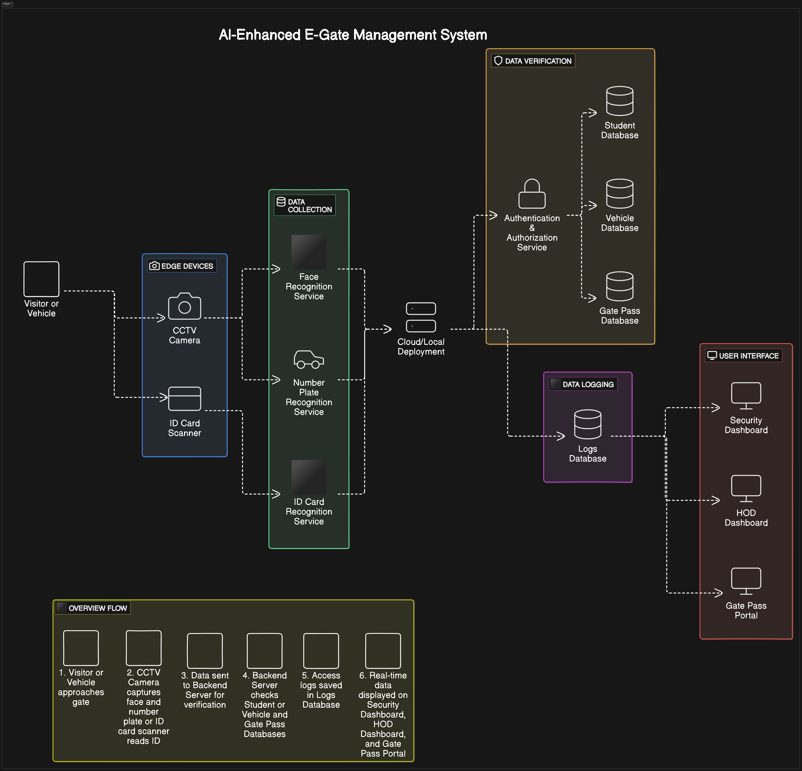
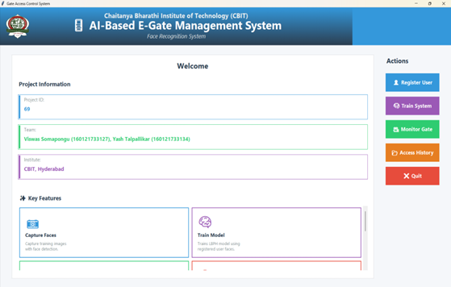
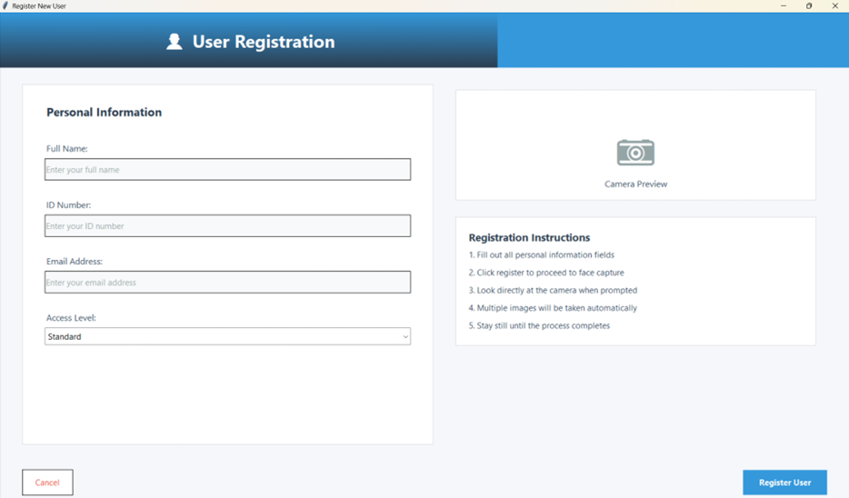
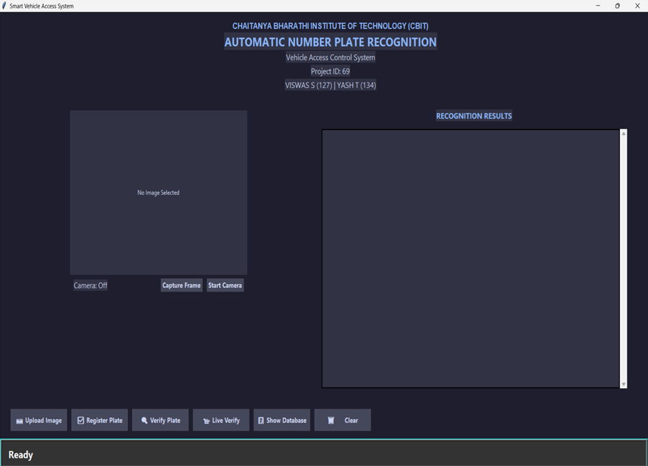
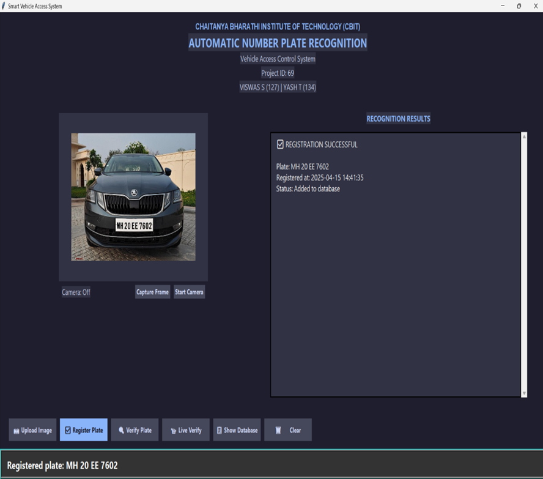
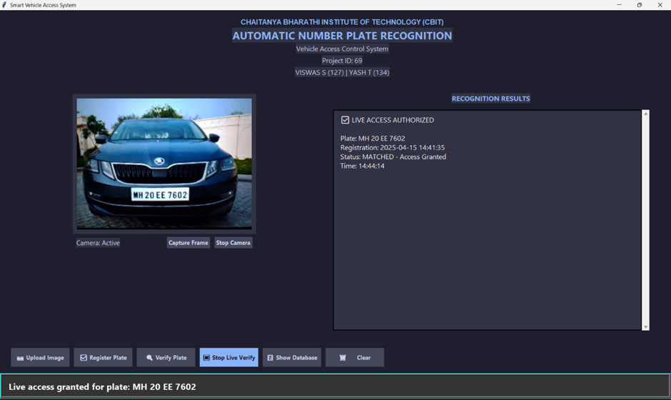
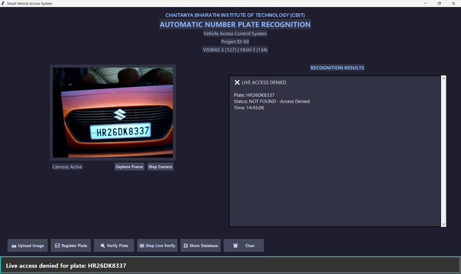

## 🔍 Overview

This project is an **AI-Based E-Gate Management System** designed to automate gate access control using intelligent technologies.  
It is divided into **two main modules**:

1. **Facial Recognition System** – Authenticates individuals in real-time using LBPH-based face recognition.
2. **Vehicle Number Plate Recognition System** – Detects and verifies vehicle license plates using the Gemini API.

Together, these modules enhance security, reduce manual effort, and streamline access at institutional gates.

### Key Highlights:
- 🧠 Face recognition using **LBPH (Local Binary Pattern Histogram)**
- 🚘 Number plate recognition using **Gemini API**
- 🖥️ Admin interface for real-time monitoring, registration, and access control
- 🗂️ MySQL database integration for logging and verification

---

## 📸 Screenshots

### System Architecture

### 1. Face Recognition

  
  
  
  
  

### 2. Number Plate Recognition

  
  
  
  

---

## 📌 Features

- 🔐 Real-time **face recognition** for entry/exit authorization  
- 🚗 **Vehicle number plate recognition** with external API  
- 📋 **Admin panel** for:
  - User registration  
  - Live monitoring  
  - Access logs with export options  

---

## 📬 Contact

Feel free to reach out for **contributions**, **suggestions**, or **improvements**!

---

## ✍️ Authors

- [Viswas Somapongu](https://www.linkedin.com/in/viswas-somapongu/)
- [Yash Talpallikar](https://www.linkedin.com/in/yash-talpallikar/)
